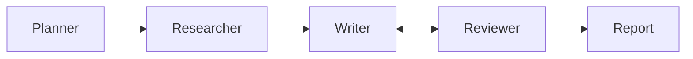

# Market Research Report Generator

This project turns a market-research question into a structured report by combining web search, fact extraction, drafting, and review loops. It is designed to reduce hallucinations by grounding every claim in search results and by checking drafts against the underlying evidence before a section is marked as passed.

## What the project does

The app follows a multi-agent pipeline:

- The planner breaks a topic into multiple research sections.
- The researcher fetches web results and extracts only concrete, source-backed facts.
- The writer drafts each section from those facts.
- The reviewer checks the draft for unsupported numbers, invented claims, and wrong attribution.
- The report assembler combines accepted sections and a deduplicated source list into a final markdown report.

The result is a concise, verifiable report for questions like: "What are the main trends in electric scooters in Pakistan?"

## Architecture



This is the same flow the project implements: Planner -> Researcher -> Writer -> Reviewer -> Report, with the Writer and Reviewer iterating until the section is accepted or the retry limit is reached.

## Windows setup

1. Open PowerShell in the project root.
2. Create and activate a virtual environment:

   ```powershell
   py -m venv venv
   .\venv\Scripts\Activate.ps1
   ```

3. Install dependencies:

   ```powershell
   pip install -r requirements.txt
   ```

4. Copy the sample environment file and fill in your keys:

   ```powershell
   Copy-Item .env.example .env
   notepad .env
   ```

5. Add your API credentials:
   - `TAVILY_API_KEY` for web search
   - provider keys depending on the model you want to use (`GEMINI_API_KEY` or `ANTHROPIC_API_KEY`)
   - optionally set `LLM_PROVIDER` to `gemini`, `ollama`, or `anthropic`

6. Run the pipeline:

   ```powershell
   python main.py "What are the main trends in electric scooters in Pakistan?" --pipeline
   ```

## Switching LLM providers

The active provider is selected by the `LLM_PROVIDER` value in `.env`:

```env
LLM_PROVIDER=gemini
# or:
# LLM_PROVIDER=ollama
# LLM_PROVIDER=anthropic
```

The project supports the following provider-specific settings in `.env`:

- `gemini`
  - `GEMINI_API_KEY`
  - `GEMINI_MODEL` (optional)
- `ollama`
  - `OLLAMA_MODEL`
  - no API key required if your local Ollama server is already running
- `anthropic`
  - `ANTHROPIC_API_KEY`
  - `ANTHROPIC_MODEL` (optional)

The app validates the configured provider at startup. If a required key is missing or looks like a placeholder, it raises a clear error instead of silently using a broken configuration.

## Running the pipeline

Use the CLI entry point in `main.py`:

```powershell
python main.py "Your research question"
```

This runs the default full pipeline (plan → research → write → review → report).

You can run the individual modes explicitly:

```powershell
python main.py "Your research question" --research
python main.py "Your research question" --pipeline
```

Optional flags:

```powershell
python main.py "Your research question" --max-sections 3
python main.py "Your research question" --no-cache
```

The generated report is saved under `reports/`.

## Running tests

From the project root:

```powershell
pytest
```

The test suite covers the research guardrail and the reviewer logic, including scenarios where facts are missing or drafts include unsupported numbers or invented claims.

## Design decisions

### Source-URL validation

The researcher does not trust the model blindly. After the LLM extracts facts, each fact is checked to confirm that `source_url` exactly matches one of the URLs returned by the web search. Facts that do not match are dropped before they enter the draft pipeline. This is the main anti-hallucination guardrail.

### Two-step reviewer

The reviewer is intentionally two-stage:

1. A deterministic rule checks numeric content in the draft against the fact pool to catch unsupported numbers and missing evidence.
2. An LLM-based review scans the draft for unsupported claims, exaggerations, and wrong attribution.

This combines a cheap, reliable check for numbers with a semantic pass for claims that cannot be reduced to a simple regex.

### Why unverified sections are labeled rather than hidden

If a section cannot be researched or cannot pass review, the pipeline does not silently omit it. Instead, it marks the section as failed and keeps the label, issue list, and source trail visible in the final report. This keeps the output honest: the user can see where evidence is weak without losing the overall structure of the report.

## Notes

- The project expects a valid `TAVILY_API_KEY` even when the model provider is set to Gemini or Anthropic because search is a required part of the workflow.
- The code and report files are intentionally separated so generated outputs remain out of source control while the implementation stays explicit and reviewable.
